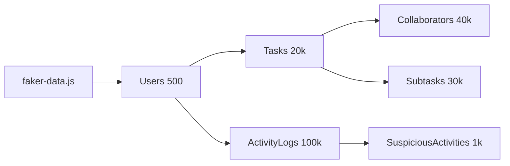
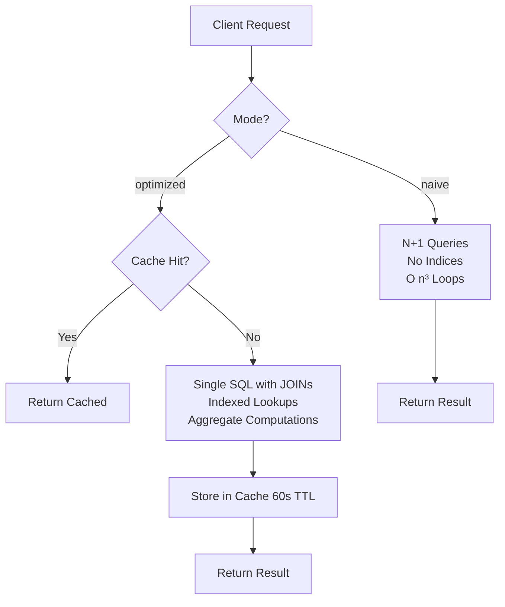
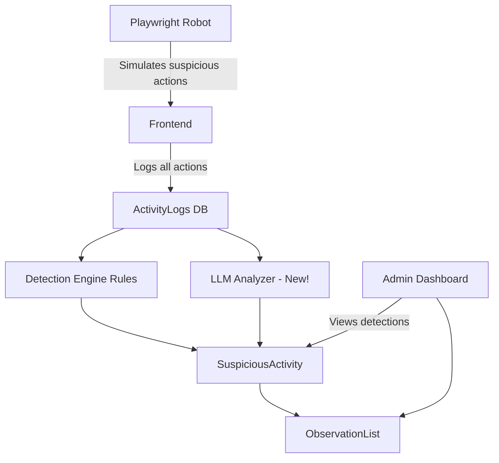

# Planex — Advanced Statistics, Optimization & AI-Driven Security Plan

## Overview

This plan covers 6 major components split across backend and frontend. Each component builds on the existing infrastructure.

---

## Component 1: Faker Data Generation

**Goal**: Populate all tables with 50,000+ records using `@faker-js/faker` to enable realistic benchmarking.

### Files to Create/Modify

| File | Action | Purpose |
|------|--------|---------|
| `planex-backend/src/scripts/generate-faker-data.js` | **Create** | Master seed script using Faker |
| `planex-backend/package.json` | **Modify** | Add `@faker-js/faker` dependency + `db:faker` npm script |

### Data Volume Targets

| Table | Target Rows | Notes |
|-------|-------------|-------|
| Users | 500 | With realistic names, emails, roles |
| Tasks | 20,000 | Spread across users |
| TaskCollaborators | 40,000 | Many-to-many links (avg 2 per task) |
| Subtasks | 30,000 | 0-3 per task |
| ActivityLogs | 100,000 | Generated historical activity |
| SuspiciousActivities | 1,000 | Mix of real detections |

### Architecture



---

## Component 2: Heavily Computational Statistics Endpoint

**Goal**: A statistics endpoint that computes complex aggregates across the Tasks-TaskCollaborators many-to-many relationship, designed to be intentionally heavy (no indices, N+1 queries) in the "naive" version.

### The Many-to-Many Relationship

**Tasks** ⟷ **TaskCollaborators** ⟷ **Users** (via `Username` string match)

This is a M:N relationship: a Task has many collaborators, and a User (matched by Name) can be a collaborator on many tasks. The join via string `Username` makes it computationally expensive.

### Statistics Computations (Heavy)

1. **Collaboration Density Matrix**: For each pair of users, count how many tasks they co-collaborate on → O(n²) complexity
2. **User Productivity Score**: Weighted score based on completed tasks, collaborator count, subtask completion rate, activity frequency
3. **Priority Distribution Heatmap**: Tasks × Priority × Status × Month — 3D grouping
4. **Network Centrality**: Which users are central collaborators (most cross-team task involvement)
5. **Activity Rhythm Analysis**: Time-of-day patterns per user, detecting unusual shifts

### Files to Create/Modify

| File | Action | Purpose |
|------|--------|---------|
| `planex-backend/src/routes/statistics.js` | **Modify** | Add `/heavy` endpoint with naive + optimized paths |
| `planex-backend/src/services/statisticsService.js` | **Create** | Core computation logic (naive + optimized) |
| `planex-backend/src/services/cacheService.js` | **Create** | In-memory cache layer |

### Endpoint Design

```
GET /api/statistics/heavy?mode=naive|optimized&type=density|productivity|heatmap|centrality|rhythm
```

### Naive Implementation (intentionally bad)

- No SQL indices used
- In-memory N+1 queries: fetch all collaborators, loop per user, re-query per task
- JavaScript-side nested loops O(n³)
- No caching
- Full table scans on every request

### Optimized Implementation

- Dedicated SQL indices on `TaskCollaborators.Username`, `Tasks.CreatedBy`, `Tasks.Priority`
- Single SQL query with JOINs and GROUP BY using Sequelize aggregate methods
- In-memory LRU cache with 60-second TTL (`node-cache`)
- Rate limiting on endpoint



---

## Component 3: Database Indexes for Optimization

### New Migration: Add Performance Indexes

**File**: `planex-backend/src/database/migrations/20260517000000-add-performance-indexes.js`

| Table | Index | Purpose |
|-------|-------|---------|
| Tasks | `IX_Tasks_CreatedBy_IsCompleted` | Filter tasks by owner + status |
| Tasks | `IX_Tasks_Priority_DueDate` | Priority distribution queries |
| Tasks | `IX_Tasks_IsCompleted` | Completion rate calculation |
| TaskCollaborators | `IX_TC_Username` | Join by collaborator name |
| TaskCollaborators | `IX_TC_TaskId_Username` | Composite for density matrix |
| ActivityLogs | `IX_AL_UserId_Action_Timestamp` | Detection engine queries |
| Users | `IX_Users_Name` | Name lookup for collaborator matching |

---

## Component 4: JMeter Benchmarking

### Test Plan Structure

| Test | Naive URL | Optimized URL | What It Measures |
|------|-----------|---------------|------------------|
| 1. Collaboration Density | `/heavy?mode=naive&type=density` | `/heavy?mode=optimized&type=density` | Response time with 50 concurrent users |
| 2. Productivity Score | `/heavy?mode=naive&type=productivity` | `/heavy?mode=optimized&type=productivity` | CPU/memory usage |
| 3. DDOS Simulation | `/heavy?mode=naive&type=density` × 1000 req/s | `/heavy?mode=optimized&type=density` × 1000 req/s | Crash resistance |

### JMeter Configuration

- **Thread Groups**: 10, 50, 100 concurrent users
- **Ramp-up**: 5 seconds
- **Loop count**: 10 iterations
- **Assertions**: Response time < 2000ms (optimized), expect failures (naive)
- **Report**: HTML dashboard comparing naive vs optimized

**File**: `planex-backend/jmeter/statistics-benchmark.jmx`

---

## Component 5: DDOS Robustness Demonstration

### Approach

1. **Naive endpoint** (no cache, no rate limit): Send 500 concurrent requests → expect high latency, server strain, eventual timeout/500 errors
2. **Optimized endpoint** (cache + rate limit): Same 500 concurrent requests → cached responses serve quickly, rate-limited excess get 429, server stays stable

### Script: `planex-backend/src/scripts/ddos-simulation.js`

- Uses Node.js built-in `http` module (no extra deps)
- Sends N concurrent requests to both naive and optimized endpoints
- Reports: success rate, average latency, error distribution, server stability

---

## Component 6: AI-Powered Suspicious Behavior Detection

### Architecture



### LLM Integration (`planex-backend/src/services/llmDetector.js`)

- Uses Hugging Face Inference API with free tier
- Analyzes activity log patterns in batches
- Detects patterns the rule engine misses:
  - Subtle social engineering (e.g., rapid password resets + profile changes)
  - Unusual navigation patterns
  - Data exfiltration attempts (mass view of tasks)
- Produces enhanced severity scoring

### New Detection Rules (Rule 7-9 in detectionEngine.js)

| Rule | Trigger | Severity |
|------|---------|----------|
| 7. MASS_VIEW | > 50 VIEW_TASK actions in 5 minutes | MEDIUM |
| 8. RAPID_PROFILE_CHANGES | > 3 PROFILE_UPDATED in 1 minute | HIGH |
| 9. CROSS_RESOURCE_ABUSE | Create + Update + Delete across 3+ resource types in 30s | CRITICAL |

### Playwright Simulation Script

**File**: `planex-frontend/e2e/suspicious-behavior.spec.js`

| Test Scenario | Behavior Simulated | Expected Detection |
|---------------|-------------------|-------------------|
| 1. Rapid Task Creation | Creates 40 tasks in 60 seconds | RAPID_SUCCESSIVE_ACTIONS |
| 2. Mass Deletion | Deletes 10 tasks in 30 seconds | MASS_DELETION |
| 3. Late Night Activity | Performs actions at 3 AM | UNUSUAL_HOURS |
| 4. Toggle Spam | Toggles 15 tasks rapidly | MASS_STATUS_TOGGLE |
| 5. Create-Delete Pattern | Creates then immediately deletes | RAPID_CREATE_DELETE |
| 6. Mass View (New) | Views 60+ tasks rapidly | MASS_VIEW |
| 7. Profile Abuse (New) | Changes profile 5+ times | RAPID_PROFILE_CHANGES |
| 8. Login Brute Force | 10 failed logins in 1 minute | EXCESSIVE_FAILED_LOGINS |

### Running the Simulation

```bash
# Terminal 1: Start backend
cd planex-backend && node src/server.js

# Terminal 2: Start frontend
cd planex-frontend && npm run dev

# Terminal 3: Run Playwright simulation
cd planex-frontend && npx playwright test e2e/suspicious-behavior.spec.js --headed
```

### Real-time Detection Dashboard

The existing [`AdminView.jsx`](planex-frontend/src/views/AdminView.jsx) and admin API routes at [`admin.js`](planex-backend/src/routes/admin.js) already support viewing SuspiciousActivities and ObservationList. The Playwright tests will verify that the detections appear in real-time via the admin API.
